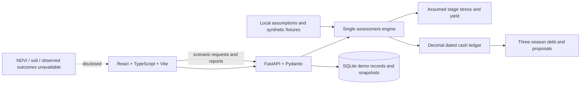

# Architecture and project summary

Sage is a local-first demonstration of agricultural credit scenario analysis. A lender can select a synthetic borrower, vary disclosed climate and market assumptions, and compare the resulting dated cash ledger, bank payment and modeled debt obligations. Every proposal remains hypothetical and every borrower record is synthetic.

The React and TypeScript interface sends assessment requests to one FastAPI service. Its Pydantic request/response contract feeds one Python assessment engine, which combines illustrative crop-stage stress with a Decimal-based dated cash ledger and a three-season debt simulation. SQLite stores seeded borrower and loan fixtures plus immutable assessment snapshots. The interface reads those snapshots and API results; financial formulas remain on the server. No network source service is required for the demo.

## Runtime boundary

The launch scripts start only loopback API and Vite servers. The API seeds two deterministic synthetic profiles on startup. `scripts/Reset-SageDemo.ps1` repeats that idempotent seed. Assessment snapshots persist in the local SQLite file; reset does not erase those report records. The demo makes no real credit decision, bank update, weather request or market data request.

## Current limitations

There are no observed crop, weather, market or repayment datasets and no calibrated prediction model. Crop timing, yield response, price and simulated repayment frequencies are assumptions. NDVI and soil moisture are unavailable. Several planned stack choices are not present: the interface uses custom CSS and state navigation; SQLite access uses `sqlite3`; nested response payloads are only partly typed. The project is a hackathon prototype, not a lending service.
