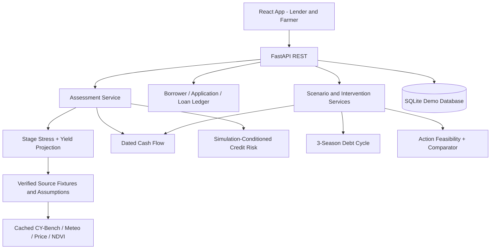

# Sage — 24-Hour Hackathon Implementation Master Plan (V2)

**Version:** 2.0 (9 October 2026) | **Event:** FUSION 2026 | **Problem:** FIN-03 — Climate-Aware Credit Risk Assessment for Agriculture (NABARD)  
**Deadline:** One 24-hour implementation window | **Recommended team:** 4 | **Output:** One integrated, beautiful, working website  
**Companion / next stage:** `Sage_FULL_Implementation_Plan_V2.md`. **Read this file first and execute it first.** The full plan is not permission to add any extra scope before the 24-hour release gates pass.

> **Build this, not a slideshow:** a polished lender-facing agricultural credit platform with a borrower/loan system, crop/weather/soil/NDVI/price intelligence, dynamic financial assessment, a genuinely connected what-if lab, a simulated hidden-debt-cycle explorer, and feasible intervention comparisons. Reuse established product features freely. Our distinction is an unusually coherent end-to-end climate-to-finance-to-action workflow, **not** an unsupported patent/academic claim of inventing satellite-driven agricultural credit scoring.

> **Do not fake ground truth.** We can source real weather and agricultural observations publicly, but not a verified Indian dataset joining individual loan defaults to crops and weather. The demo borrower/loan records and resulting repayment probabilities are synthetic/simulation-conditional. Label this in the app, exports and judging pitch. The website must explain the basis of each score, rather than call illustrative output a proven bank default forecast.

---

## START HERE — strict authority, 24-hour scope and expansion boundary

**Who this is for:** an implementation agent (Codex), possibly supervised by one human. Begin in an empty repository containing this file, optionally the full-plan companion and the permitted dataset snapshots. This is a **coding specification**, not a presentation outline. Begin with Gate G0; implement through G9. Do not spend the first hours writing another lengthy plan rather than code.

**Source-of-truth precedence:** (1) official FIN-03 requirements; (2) this hackathon V2 file for what to build now; (3) this file's interface contracts and invariants; (4) full-plan V2 for *architectural background and post-release upgrades only*; (5) the improvements-file analysis below. If documents conflict about scope, **this file wins until the hackathon release is verified**.

**Product name:** `Sage` is a *working name*, not a permanent brand decision. Create a `PRODUCT_NAME` config/environment value and use it throughout the UI so branding can change without editing domain logic.

**The explicit path to full:** G0–G9 hackathon gates → offline working release + source/claim audit + passing tests + acceptance sign-off → optional extension gates in `Sage_FULL_Implementation_Plan_V2.md`. Do **not** reinitialize the repository, rebuild the UI framework, duplicate assessment services, or force an early migration to PostgreSQL just to satisfy the full document.

**What's new in V2:** the original 24-hour coverage remains, but three features now have concrete designs and tests: `H27` **Baseline / Climate Shock / Intervention comparison**, `H28` **Debt-Cycle Early-Warning Rules**, and `H29` **Repayment-Gap Financial Impact Waterfall**. Their logic is entirely derived from the *same* authoritative scenario assessment; they must not have independent score calculators. Six other aspects of the nine-item improvements memo are treated as refinements or already-existing requirements, not duplicate subsystems.

**A strict temporal distinction:** The 24-hour calendar is a *delivery budget*, not a promise that Codex can run autonomously continuously or that a model session will survive 24 hours. Persist work in Git and `IMPLEMENTATION_STATUS.md`; if halted, resume from the last verified gate. Codex can generate code quickly, but the countdown must also cover dependency problems, data verification, integration, QA and the demo.

### V2 merge decision — all nine improvement proposals, no duplication

| Improvement from evaluation MD | Existing feature(s) | V2 decision | Minimal net-new work |
|---|---|---|---|
| 1. Repayment Stress Timeline | H04, H10, H12; Scenario Lab | **Retain and refine** | Add exact cash-before/cash-after-due markers, harvest/sale timing, source provenance |
| 2. Baseline vs Stress vs Intervention | H11, H15 | **Add as H27** | Single three-column frozen-context response and linked UI |
| 3. Risk Explanation & Evidence | H09, H12 | **Refine** | Calculation trace and source/assumption drawer; no new LLM/SHAP dependency |
| 4. Uncertainty & Data Quality | H02, H06–H08, H22, H24 | **Keep lightweight** | Observed/forecast/reanalysis/assumed/simulated/missing chips + sensitivity, no fake confidence |
| 5. Constrained Intervention Comparison | H15, H20 | **Already implemented by specification** | Tighten identical-shock counterfactual comparison; not a second optimizer |
| 6. Debt-Cycle Early Warning | H13–H14, H17 | **Add as H28** | Deterministic rule-based warnings emitted from 3-season ledger |
| 7. Reproducible Records | H18, H21 | **Refine** | Stable input hash, saved version, reopen, export current snapshot |
| 8. Risk Impact Decomposition | H10, H12 | **Add as H29** | Derived financial bridge/waterfall with an exact reconciliation test |
| 9. Single Assessment Engine | Section 2.2 | **Already mandatory** | Enforce with contract and one cross-page acceptance test |

**What not to do in V2:** add a second scoring pipeline, a new probabilistic modeling service, a separate explanations microservice, heavy audit machinery, causal interpretations of simulated comparisons, or a bespoke Kafka/Redis/Celery setup. Training the *yield model* on real usable data is **preferred**, but a custom model on fabricated bank outcomes is **not** required or defensible.

---

## 0. Hard mission and scoring priorities

**Our selection preferences:** no physical hardware, no GeoAI track, 24-hour build, convincing apparent novelty based on working mechanisms, substantive integrated features, excellent UI/navigation and a smooth interactive judge demonstration. Do not burn six hours chasing Scopus indexing, extremely complex deep learning, Kubernetes, unrelated AI agents, or exhaustive validation. A few calculation integrity checks remain mandatory.

### 0.1 The one-line demo story

> “A farmer can repay the bank on time and still fall into financial strain. Sage traces crop-stage climate stress into harvest income and dated loan cash flow, contrasts formal repayment with modeled financial sustainability, and compares eligible actions across future seasons.”

**Core path that must work:** `Overview → Borrower → Farm/Loan Data → Dynamic Assessment → Scenario Lab → Multi-Season Debt Cycle → Intervention → Report`.

**Everything else is secondary**. End-to-end integration beats a massive feature count with dead buttons.

### 0.2 Finish levels and release bars

- **GOLD (target):** 7 major product sections, ≈18–22 fully working capability slices, beautiful UX, real climate/NDVI/yield inputs where genuinely available, dynamic risk, all three differentiators, three-way comparison, actionable debt-cycle warnings and repayment-gap decomposition, lender monitoring and reports; optional budget allocator.
- **SILVER (must achieve):** lender shell, borrower/loan records, core FIN-03 inputs, dynamic assessment with explainable output, three-way comparison (baseline/stress/action), masked-loan-vs-sustainability simulation with at least one derived warning, two calculated intervention comparisons, export; a compact numeric impact breakdown is acceptable if waterfall chart polish is incomplete. No disconnected placeholders.
- **BRONZE (emergency recovery):** one real/weather-plus-accurately-marked-assumption borrower pathway with complete inputs, baseline and shock scenario, recomputed yield/cash/risk, debt cycle and one valid intervention. Still demonstrates FIN-03 and novelty; do not hide what was cut.

### 0.3 Non-negotiables

- All required FIN-03 input types are represented in data model + UI (satellite, weather forecast, soil, crop, irrigation, yield history, market price, credit history). If a source is missing, its panel must state missing/assumed — not silently fabricate “verified” rows.
- Repayment risk is dynamic and its displayed amount/probability changes via **backend calculation**.
- All pages use the same loan, borrower, crop season, as-of, scenario and model-version references.
- Distinguish observed historical weather from issued forecasts and our slider-driven hypothetical shocks.
- No trained model on imagined real defaults presented as externally validated. No certified “hidden borrowing detector.”
- Scenario calculations are persisted or reproducible by seed/input hash.
- Backend works from cached local fixture data during final demo, even if the Internet fails.
- Aesthetic UI is part of the task, not postponed to the last 10 minutes.

---

## 1. Data feasibility checkpoint — prevent the biggest 24-hour failure

### 1.1 Sources to use and backup decisions

| FIN-03 input | First choice (free public) | Backup | How to label |
|---|---|---|---|
| Crop and calendar | [CY-Bench India wheat/maize](https://zenodo.org/records/13838912), archive subset | Crop calendar parameters configured for one India wheat/maize season | `Historical study` or `Assumed crop calendar` |
| Historical yield | CY-Bench actual India yield series for supported district/year | Validated publicly accessible district crop statistics; if unavailable, explicitly *assumed yield baseline* for weather-conditioned demo | `Observed historical yield` / `Assumed scenario baseline` |
| NDVI/FPAR satellite | CY-Bench precomputed NDVI/FPAR | one annotated public Sentinel-2 selected region if time permits; else show missing source | `Observed satellite index`, geo resolution displayed |
| Weather history/soil | CY-Bench AgERA5/GLDAS aligned files | [Open-Meteo historical](https://open-meteo.com/en/docs/historical-weather-api) by known location/date | `Reanalysis` or `Observed model product` |
| Weather forecast | [Open-Meteo forecast](https://open-meteo.com/) cached response | Pre-saved issued forecast or clearly named climate scenario analogue | `Forecast (issued...)` or `Historical analogue` |
| Irrigation | Cropping district proportion if available; demo borrower irrigation parameter | Explicit borrower-entered demo value | `Synthetic borrower input` |
| Market price | Public AGMARKNET historical snapshot, unit/source/date verified | Documented market snapshot; if not accessible, user-entered price assumption | `Archived price` / `Scenario assumption` |
| Credit history | Synthetic loan/repayment records | No real-bank fallback needed | `DEMO LOAN RECORDS` |
| Informal borrowing | User-controlled simulated bridge parameter | 0 by default | `Modeled scenario, not observed fact` |

**Critical operational caveats:** CY-Bench original dataset ZIP is very large; avoid a 12+ GB download on hackathon Wi-Fi unless already cached legally and event rules allow it. The small public CY-Bench example repository may not contain India; do not pass US/Spain values off as Indian crop observations. Neither a Zenodo landing page nor an API documentation page proves the exact required data file was successfully downloaded. At build time, verify real bytes and CSV columns, and keep an honest fallback.

### 1.2 Competition preparation boundary

Check FUSION rules: do they allow pre-event data collection, open-source starter templates or source packaging? **Do not assume** that prebuilt code, pretraining or dataset extraction outside the 24-hour window is permitted. If legal: pre-download research data, vendor libraries and icons; do not pre-build contest solution if forbidden. If prep is not permitted, use the on-clock timed data checkpoints below. Either way demo offline caches must be created legally during permitted time.

### 1.3 At T+60 minutes, decide source readiness

Engineer A must produce `data/manifest.yaml`, at least 1 parsed real weather file with known region/crop time windows, a provenance screenshot or CLI log, one valid region/season, and a `data/fixtures/` candidate. If India CY-Bench cannot be extracted promptly, **stop the download** and use an available, traceable public weather/crop source + labeled demo yield assumptions. The platform remains legitimate as a simulation but must not claim a trained real yield model.

### 1.4 Demo geography

Choose **one Indian district/crop/season only after actually checking available data**. Baseline recommendation: wheat (rabi) or maize (kharif) because CY-Bench targets both; select whichever has a complete inspected dataset at execution time. Add a second crop/district only after P0+P1 is complete. If no exact district can be verified, use documented real geo coordinates and a clearly assumed district-level crop baseline; do not invent measured NDVI.

### 1.5 Updated candidate sources and trained-yield checkpoint (V2)

| Source | URL | Role | Stop condition |
|---|---|---|---|
| CY-Bench, archived version pin | https://zenodo.org/records/13838912 | Integrated Indian wheat/maize historical yield, remote sensing and agroclimate; **12.7 GB main ZIP** | Do not attempt full download during hackathon unless legitimately cached and efficient extraction is possible |
| ICRISAT district climate–yield panel (Mohapatra, Mendeley Data, 2023) | https://data.mendeley.com/datasets/ywp3y5j9vv/1 | **Optional lightweight alternative**: 560 Indian districts / 20 states / 1990–2015, historical crop/climate panel | Verify anonymous file *bytes*, columns, suitable crop/year/district and rights; page listing alone is insufficient |
| Open-Meteo historical weather | https://open-meteo.com/en/docs/historical-weather-api | Verified-model reanalysis weather/soil variables for location/time | Cache valid JSON with precise timestamps; historical reanalysis is not live station observation |
| Open-Meteo forecast | https://open-meteo.com/en/docs | Issued forecast (when retrievable) | Local cached issued JSON; distinguish a hypothetical scenario from issued forecast |
| ICRISAT VDSA small extracts | https://zenodo.org/records/8224522 | Optional household/plot economic context | Only use inspected, documented variables; no inferred real defaults |
| AGMARKNET / reproducible price extract | https://www.data.gov.in/catalog/current-daily-price-various-commodities-various-markets-mandi | Market price by crop, mandi, date, unit | Use timestamped, verified extract, otherwise explicit synthetic/demo assumption |
| Earth Search / Sentinel-2 | https://earth-search.aws.element84.com/v1 | Selected satellite scene/NDVI where genuinely available | No farm-specific index without spatial and acquisition resolution verification |
| CropYQ model | https://huggingface.co/BirendraSharma/cropyq | **Comparison only**; reporting-year/country/crop signal lacks our climate/NDVI/irrigation input coverage | Never make this the primary climate-sensitive yield engine; inspect artifact security |

**Dataset honesty:** Mendeley is described on its public record as *ICRISAT District-Level Data*, not as an ICAR-IIHR dataset. Its climate–yield panel is historical; do not invent the presence of crop-stage time series, NDVI, soil moisture, or loan records without inspecting its files. CY-Bench India administrative mapping and overlap still require actual row checks. A zero-cost landing page is not proof that bulk downloads work anonymously.

**Yield model deadline:** parallel with G0–G2, attempt a **real-data** `Ridge` or `HistGradientBoostingRegressor` only if a genuinely aligned Indian crop/region training table is usable. Require target (`yield_t_ha`), observed covariates (available by issue time), nonzero variation, years/districts and a valid chronological split. Record sample counts, region/crop, year range, MAE and baseline MAE, and save a usable fitted artifact with pinned schema. Cap exploration/training effort at **20–30 minutes** after a usable table is available. If it is not suitable, switch unambiguously to Y2 (documented illustrative yield response), and do not call it trained AI. **Never halt the functional financial platform waiting for training.**

---

## 2. Architecture — minimal moving parts, maximal integration

### 2.1 Fixed competition stack

- **Frontend:** React + TypeScript + Vite, Tailwind CSS, shadcn/ui, Lucide icons, Recharts, TanStack Query, React Router. Use a plain favicon/logo symbol, not endless AI-generated illustrations.
- **Backend:** Python + FastAPI + Pydantic; pandas and NumPy; scikit-learn **only if** training a real yield baseline or synthetic credit classifier materially helps. Pure Python for financial ledger and intervention checks.
- **Storage:** SQLite for demo (fast, no auth/setup), SQLAlchemy ORM; `data/fixtures/*.csv|json`, `artifacts/models/*.joblib` where relevant. Switch to PostgreSQL later, not during the 24 hours.
- **Geography:** simple district selector + SVG/GeoJSON map (only with valid boundaries), optional MapLibre. **Map is not a blocker**; list and chart can be prettier and more reliable.
- **Deployment:** local frontend/API or simple hosting after stable offline demonstration. Docker Compose only if already familiar; otherwise do not spend hours setting up.
- **Not used:** K8s, Kafka, Grafana, heavy ML training, vector DB, graph DB, blockchain, payment gateway, fake live bank APIs, proprietary map tokens.

**Architecture diagram**



### 2.2 One authoritative “assessment orchestrator”

#### V2 orchestration signatures and derived presenters (implementation requirement)

All new V2 widgets are **projections of a canonical `ScenarioResult`**, not separate analytical engines. Organize pure calculators by function: `compute_stage_stress`, `estimate_yield`, `build_dated_ledger`, `evaluate_shortfall`, `simulate_debt_seasons`, `evaluate_candidate_intervention`, `derive_warning_rules`, `derive_impact_bridge`, `explain_assessment`. The assessment service assembles these in causal/timing order. Persist **base scenario input + frozen source snapshot + engine/model version + generated output** so reruns are meaningful.

`ScenarioBundle` contains `{baseline, stress, intervention?, comparison, source_warnings}`. The baseline and stress use identical starting borrower finances, prices (except user-specified price shock), sources and horizon; intervention begins from the **same stress shock**, modifying *only* the eligible action's dated flows/loan schedule. Never compare an action under normal weather to a stress case under drought and credit the difference to the action.

For expensive inputs, cache source fixtures by `region/crop/date/snapshot`; for 50–200 borrowers the calculator may run synchronously. No Redis, Celery or Kafka required. API is stateless for calculation and stores only saved snapshots in SQLite.

**All screens call `evaluate_scenario`**, which runs, in order:

1. Resolve immutable borrower, crop, loan schedule and current `as_of` + input source snapshot.
2. Generate crop growth stage windows from selected crop calendar.
3. Compute observed-to-date, forecast or scenario climate stress per stage using actual dataset variables or documented parameters.
4. Predict yield/harvest price and revenue under baseline and override.
5. Generate dated cash transactions and repayment obligation balance.
6. Calculate scenario-based shortfall and simulated repayment feasibility/conditional credit-risk estimate.
7. When requested, simulate N future seasons and optional informal debt bridging.
8. When requested, enumerate feasible interventions and compare against **same frozen baseline**.
9. Build meaningful driver narrative and warnings (real vs assumed input; uncertainty; source freshness).
10. Return one versioned response used by UI pages, watchlist, exports and comparisons.

Don't implement independent client calculators for the dashboard and Scenario Lab. Don't hardcode separate pie-chart percentages. Every score derived from shared backend functions.

### 2.3 Minimal repo tree and team-owned files

```text
sage-hack/
  README.md
  IMPLEMENTATION_STATUS.md
  DATA_SOURCES.md
  .env.example
  backend/
    app/main.py
    app/config.py
    app/db.py
    app/models.py
    app/schemas.py
    app/routes/{portfolio,borrowers,loans,climate,assessments,scenarios,interventions,reports}.py
    app/services/{bootstrap,stage_stress,yield_projection,price,ledger,
                  credit_estimate,hidden_stress,debt_cycle,assessment,
                  interventions,portfolio,explain,export}.py
    app/adapters/{cybench,weather,prices}.py
    app/data/{source_fixtures/,demo_borrowers.json,
              crop_rules.yaml,price_fixtures.csv}
    app/tests/{test_ledger,test_assessment,test_debt_cycle,test_interventions,test_api}.py
    requirements.txt
  frontend/
    src/app/{App.tsx,router.tsx,AppShell.tsx,FarmerShell.tsx}
    src/components/{ui,charts,finance,climate,risk,layout}/
    src/pages/{Landing,Overview,Borrowers,BorrowerDetail,Applications,
               Loans,Climate,Assessments,ScenarioLab,InterventionCenter,
               Watchlist,Reports,FarmerHome,Methodology}.tsx
    src/lib/{api.ts,types.ts,format.ts,theme.ts}
    src/hooks/{useBorrower,useAssessment,useScenario}.ts
    src/styles/index.css
    package.json
  data/manifest.yaml                  # one authoritative source manifest
  scripts/{seed_demo.py,smoke_test.py,run_demo.sh}
  demo/{script.md,scenarios.json,judges_faq.md,screenshots/}
```

Ownership (4-person): A data+agronomy, B backend financial/risk, C frontend and UX, D integration/interventions/QA. Freeze endpoint shape at T+1h before separate module development.

---

## 3. Website experience — beautiful, easy to navigate, never “AI dashboard clutter”

### 3.1 Visual direction and design tokens

“**Editorial banking workspace with agriculture intelligence**.” Use warm-off-white surfaces, deep forest green, muted olive, amber for caution, restrained red for high risk, near-black text. No gradients, glassmorphism, neon, generic faceless AI mascot, randomly moving graph or huge stock-photo hero.

```css
:root {
  --canvas: #F6F7F3;
  --paper: #FFFFFF;
  --forest: #164D3B;
  --forest-dark: #103E30;
  --ink: #17241F;
  --muted: #64736B;
  --line: #DAE2DC;
  --positive: #217A56;
  --caution: #A5671D;
  --danger: #B2473E;
  --scenario-tint: #F7EFE2;
  --radius: 14px;
}
```

Use **Inter** or IBM Plex Sans, optionally IBM Plex Mono for figures. Sidebar 232–244px, main max 1440px. Typical card radius 12–14px, subtle borders, shadow reserved for overlays. Grid spacing 16/24px. Section headings 20–24px; route headers ~30px. Very legible tables, no tiny 9px font. Desktop primary, mobile functional (collapsible sidebar; stacking, not shrink-to-fit).

### 3.2 Sidebar hierarchy (7 product sections)

```text
Sage                       [DEMO MODE]

WORKSPACE
  Overview
  Borrowers
  Applications & Loans

INTELLIGENCE
  Climate Intelligence
  Credit Assessment
  Scenario Lab            ← flagship interactive

DECISIONS
  Intervention Center    ← flagship differentiation
  Watchlist & Reports

BOTTOM
  Farmer View
  Data & Methodology
  Settings / Demo Reset
```

Do not create each minifeature as its own route. Tabs inside borrower and climate pages are sufficient. Route names must match actual implemented functionality. Suggested routes `/`, `/app/overview`, `/app/borrowers`, `/app/borrowers/:id`, `/app/applications`, `/app/loans`, `/app/climate`, `/app/assessments`, `/app/scenarios`, `/app/interventions`, `/app/watchlist`, `/app/reports`, `/farmer`, `/methodology`.

### 3.3 Screen-by-screen demo specification

**Landing:** product identity, one-line problem, visual “Climate → Harvest → Repayment → Resilience” mini-flow, two CTAs `Launch interactive demo` and `How it works`; honest `Demo uses real public agricultural sources where available and simulated lending records`. Hero should be typographic + a mini embedded software mockup made from HTML, not nonfunctional stock photos.

**Overview:** 4–5 compact KPI cards with trend and scope, risk segmentation by crop/branch, 30-day due calendar, watchlist with `Investigate`, “Climate event snapshot” and a right-side action queue. Each KPI clicks into appropriately filtered real records. Display date/source chip clearly.

**Borrowers registry:** 50–200 synthetic borrowers (not 20k unmanageable); columns borrower ID, crop, district, land area, irrigation, loan due, assessment, modeled shortfall flag. Search, filters, sorting, open borrower. Create/edit demo borrower if time; no fake email/KYC validation.

**Borrower detail:** sticky header: pseudonym, field/crop, branch, due date, on-time status, prominent dual risk states. Tabs:

- `Overview`: credit and farm card, quick explanation.
- `Farm & Climate`: stage timeline + NDVI + soil moisture + weather source/forecast.
- `Loan & Cash Flow`: event ledger, borrower inputs, due-date waterfall.
- `Assessment`: modeled risk estimate and principal drivers.
- `Financial Resilience`: 3-season formal vs total-debt graph.
- `Recommendations`: precomputed comparison from service, review actions.

**Applications & Loans:** seeded applications, wizard to make a new application with crop, acreage, irrigation, loan amount/rate/due date and 1–2 financial inputs; separate loan schedule table; status transition `draft → assessed → review → demo decision`; no real loan disbursement. Application edit must invalidate old score.

**Climate Intelligence:** 2-column layout. Left: region/crop selector + **optional** map of selected area. Right: stage calendar and observed climate/weather cards, NDVI history, soil status, price trend. Forecast issued date/valid period and actual index resolution shown. If no valid NDVI, do **not** show a fabricated green heatmap; show `Satellite data unavailable for this selection` and source note.

**Credit Assessment:** borrower selector, data completeness (8 official inputs), risk estimate labeled `Simulation-conditioned`, shortfall amount, top drivers, payment-due timeline, `Run scenario` primary CTA. Visually distinguish credit rating estimate from actual formal repayment status. Explanations should cite input sources and calculation sign.

**Scenario Lab (flagship):** left rail controls `Rainfall deficit`, `Heatwave duration`, `Heatwave stage`, `Crop price change`, `Irrigation coverage`, optional `Due date`, `Informal bridge`, selected forecast method. Center shows synchronized timeline `Shock → Stage stress → Yield → Revenue → Bank due → Remaining cash`. Bottom split: baseline vs scenario values and 3-season debt trajectories. Right rail “Why did risk change?” driver cards, method and warning. All results from backend. Provide Reset, Compare, Save/Copy Scenario; last valid result stays visible during recompute with status.

**V2 comparison panel:** directly under the stage/cash timeline, add a **three-column side-by-side result surface**: `Expected baseline`, `Climate stress`, `Stress + selected intervention`. Synchronize units and axes; show yield, revenue, cash available *immediately before* due, due amount, modeled gap, formal vs informal debt after season 3, and action incremental interest/fees/cost. A different color and a clear "hypothetical" ribbon identify the third column. Changing a slider invalidates stale action results and forces an action rerun from the **new stress** scenario. Without any action, show a functional `Compare actions` control, not invented reduction numbers.

**V2 shortfall decomposition:** an immediately adjacent bridge/waterfall begins with baseline cash before bank due, applies individually computed reductions/increases (yield quantity, selling price, input cost, other receipts/expenses), arrives at shocked cash before due, subtracts bank due to show end liquidity, and labels the shortfall `max(0, due − available positive eligible cash)`. Explanations show source vs assumption for each bridge component. A fallback **reconciled table** is allowed if Recharts waterfall layout is delayed; mathematical consistency is not optional.

**Intervention Center (flagship):** borrower selected from last scenario, proposal tiles `Reschedule due date`, `Installment restructuring`, `Irrigation support`, `Insurance what-if (only when valid)`, `Officer outreach` (no magical cash effect). Each tile: eligibility, assumed cost, shortfall improvement/longer-term penalty, next-season debt chart. Buttons `Compare`, `Submit for demo review`. A separate `Portfolio allocation` tab only if ready: use a limited *hypothetical* support budget and show selected borrowers, constraints and remaining budget.

**Watchlist & Reports:** sort by gap, risk band, due date, source freshness; acknowledge/assign simulated outreach; create report PDF/CSV or at minimum printable HTML and CSV export containing actual scenario numbers and provenance. Don't claim you've built a PDF renderer if only screenshots exist.

**V2 early-warning presentation:** watchlist and borrower resilience tabs show rule-derived warnings from the scenario debt ledger, not fictional real-world loan detection. Every warning has an ID, severity, season, triggering values, a brief trace, a proposed officer action and `simulation_only: true` where relevant. Warnings must link into the same exact saved borrower/scenario on the three-way comparison. Re-running the scenario updates or clears warnings; acknowledge/assign statuses are officer workflow metadata and must not artificially change modeled risk.

**Farmer View:** mobile-first, simple one-page summary, current crop and stage, upcoming repayment date, indicative cash position, optional interventions and “talk to loan officer”; Hindi labels as stretch. No raw internal SHAP waterfall or competitor farmer profiles.

**Methodology and Sources:** visible source list with URLs, dataset date/version, observed/forecast/simulated categorization, limitations including no real joined default dataset and related prior art; also useful to answer judges.

### 3.4 Design implementation checklist

- [ ] Fixed visual components (typography, spacing, border, shadow) across routes.
- [ ] Good table hierarchy; filter chips; correct INR, hectares, `t/ha`, `mm`, `°C`, and dates.
- [ ] Contrast and icon + text for risk levels; no red-only signaling.
- [ ] Chart tooltips cite source and explain x/y/units. No impossible precision.
- [ ] Meaningful empty, loading, stale-data, API-error states.
- [ ] Screens designed at 1440px and 390px widths before final polish.
- [ ] Sidebar always indicates active page, borrower tabs route back predictably.
- [ ] No fake “real time” ticker, empty “AI powered” badges or nonfunctional CTA.
- [ ] Demo banner states: “Real environmental data where noted · Simulated lending data.”
- [ ] Screens share at least one chosen demo borrower, season and scenario.

---

## 4. Working feature contract — P0, P1 and stretch

Every feature below has an action, a backend outcome and an end-to-end verification.

| ID | Priority | Feature | Interaction / acceptance |
|---|---|---|---|
| H01 | P0 | Professional app shell & navigation | Every sidebar route works; mobile drawer, breadcrumbs and active state |
| H02 | P0 | Demo data trust labels | All financial records marked synthetic; source chips on climate charts |
| H03 | P0 | Borrower registry | Search/filter and open actual seeded borrower records |
| H04 | P0 | Loan details / schedule / history | Chronological due dates and repayments based on ledger |
| H05 | P0 | Crop calendar | Show dated growth stages for supported crop/region |
| H06 | P0 | Historical climate/satellite/soil | Real cached input where validated; visible missing states otherwise |
| H07 | P0 | Weather forecast context | Issued-date real forecast or clearly labeled analogue |
| H08 | P0 | Irrigation, yield and price | Values represented, unit/provenance, used in calculations |
| H09 | P0 | Dynamic credit-risk estimate | API returns model/simulation-conditioned repayment probability and drivers |
| H10 | P0 | Dated finance ledger | Loan cash, crop income, inputs and due amount reconcile |
| H11 | P0 | Scenario Lab controls | Same backend reevaluates baseline vs new shock |
| H12 | P0 | Stress-at-Due visualization | Stage-specific climate stress linked to actual repayment date |
| H13 | P0 | Hidden borrowing scenario | Toggle bridge financing and see formal payment vs total-debt differences |
| H14 | P0 | Three-season debt cycle | Debt carrying and interest across future seasons, reproducible |
| H15 | P0 | Basic intervention comparison | At least 2 constrained actions, projected cash and cost effects |
| H16 | P0 | Borrower and officer views | Separate readable farmer summary and officer assessment |
| H17 | P0 | Demo flow / watchlist | Select a warning → open borrower → scenario/assessment |
| H18 | P0 | Report/export | Download or print source-labeled saved scenario |
| H19 | P1 | New application wizard | Create synthetic application, save, review, change terms |
| H20 | P1 | Portfolio budget optimizer | Nontrivial constrained selection within budget, show alternatives |
| H21 | P1 | Historical saved scenario comparisons | Saved baseline and scenario with shareable ID |
| H22 | P1 | Data source/freshness panel | Open source provenance and cache timestamp |
| H23 | Stretch | Regional map | Only for valid geo + district polygons; never fake farm precision |
| H24 | Stretch | Model yield interval | Only when properly calibrated; otherwise scenario range |
| H25 | Stretch | Hindi farmer templates | Verified natural language and no false claims |
| H26 | Stretch | Auth and advanced RBAC | Demo guest first; security if deploying real records later |
| **H27** | **P0 (G4)** | **Three-way baseline / climate / intervention comparison** | All three results from same frozen context; action reruns under the stress scenario; meaningful cost/debt deltas |
| **H28** | **P0 (G4)** | **Derived multi-season debt warnings** | Rule-backed warning IDs and exact evidence; no alleged real hidden-loan detection |
| **H29** | **P1 (G5)** | **Repayment-gap impact waterfall** | Source-linked bridge that exactly reconciles dated cash; table fallback acceptable |

P0 is intentionally ambitious for 24h. If a feature is not integrated by the gate, reduce it immediately instead of presenting it as complete. **H01–H18 are the ambition; the minimum silver cutoff is core requirements plus H11–H15**. Financial calculations and novelty demonstrations take precedence over ancillary CRUD and maps.

---

## 5. Backend data objects, score semantics and calculation rules

### 5.1 Tiny, sufficient SQLite tables

`borrowers(id, alias, district, crop, area_ha, irrigation_frac, land_class, branch, synthetic=true)`  
`crop_seasons(id, borrower_id, crop, sowing_date, harvest_date, region, source_status)`  
`loans(id, borrower_id, principal_inr_decimal, annual_rate, disbursed_at, due_at, synthetic=true)`  
`loan_events(id, loan_id, date, kind, amount_inr_decimal, source)`  
`applications(id, borrower_id, requested_principal, due_date, workflow_status)`  
`data_sources(id, url, type, version, retrieved_at, observed_period, resolution, verified_bytes)`  
`regional_climate(region,crop,date,precip_mm,tmax_c,soil_moisture,ndvi,source_id,observation_type)`  
`yield_history(region,crop,year,yield_t_ha,source_id)`  
`price_history(region,crop,date,price_inr_qtl,source_id)`  
`assessments(id, borrower_id, as_of, scenario_json, result_json, baseline_id, input_hash, created_at)`  
`watchlist(id, borrower_id, assessment_id, reason, status, assigned_to)`  
`action_reviews(id, borrower_id, scenario_id, proposal_json, review_status, timestamp)`

SQLite is sufficient for 50–200 seeded borrowers; money must use `Decimal` in Python with TEXT/NUMERIC conversions (or integer paise), not binary floats for stored balances. No actual PII; aliases `Demo Farmer 001`, not fake personal identities pretending to be real.

### 5.2 One immutable current “demo context”

A `demo_context` includes `selected_region`, `crop`, `as_of_date`, `weather_fixture_version`, `yield_fixture_version`, `price_fixture_version`, `crop_rule_version`, `seed`. Every assessment stores it. Forecast “as-of” cannot be in the future relative to a saved assessment. Allow choosing one known historical scenario date for replay **or** real current issued forecast; do not mingle a 2024 harvest actual with a forecast supposedly made in 2023.

### 5.3 Why there must be two repayment measures

**Official FIN-03 asks for climate-adjusted repayment probability.** We can deliver a *modeled* probability using a transparently simulated credit book. It is not automatically the same as cash shortfall.

- `p_cash_shortfall_given_scenarios`: proportion of sampled weather/price futures where dated cash resources are below bank due. Example: 9 of 20 equally weighted analogues have cash shortage → 45% **modeled scenario shortfall frequency**, **not** observed bank default rate.
- `p_repayment_simulated_model`: supervised synthetic borrower repayment classifier **only if** generated outcome labels/feature schema are tracked; alternatively a declared simulation-based *repayment feasibility probability*. Label as simulated estimate, not real observed “chance of default.”
- `observed_formal_repayment_status`: on-time/late/unknown in demo loan ledger (itself simulated).
- `modeled_sustainability_status`: whether recurring total obligations need bridging and/or generate persistent projected shortfalls.

UI calls out: `Repayment estimate is conditional on synthetic lending assumptions; not calibrated to real borrowers.` If classifier is weak/unavailable, show the scenario shortfall probability prominently, and separately mark the “repayment probability” requirement as *simulation-only estimate* (never silently promote a deterministic risk score to a validated probability).

### 5.4 The fixed financial math (implement before UI polish)

All money transactions happen on a **date**. For each date, add/subtract:

```text
Cash after date = cash before date
                + bank disbursement + income + harvested sales
                + insurance payout (only if eligible and triggered)
                + informal bridge loan draw (only if assumed)
                - seed/fertilizer/labor/other crop cost paid on date
                - living expenses on date
                - bank principal/interest paid on date
                - informal principal/interest paid on date
```

**Avoid double counting:** Crop production inputs funded by a loan are paid once as expenses when incurred; the funding principal arrives once on disbursement; the principal is repaid separately on the repayment date. Do not also subtract all input costs from a `net_income` number that has already removed them.

Define `shortfall_at_due` from running liquidity immediately before bank debt is due, after allowed cash buffer. Post-due harvest sales cannot finance a prior due date unless loan timing changes.

**Example for smoke test only:** initial cash ₹10,000; bank loan +₹70,000; inputs −₹60,000; crop sale +₹100,000; household expense −₹15,000; bank repayment −₹77,000. Closing cash is ₹28,000. A weather shock that delays sale until **after** due date can create a *temporary due-date gap* even if seasonal closing cash is positive. Explicit ledger ordering is the whole point of Stress-at-Due.

### 5.5 Stage-specific climate processing

No huge satellite classifier. Read crop stage dates from validated crop calendar or documented rule file. At a minimum stages: planting, vegetative, flowering, grain-fill, harvest. For each stage aggregate precipitation, Tmax heat days, a water-balance proxy/soil moisture if available, NDVI anomaly if dates/resolution permit. Define stress `S_k` as a weighted, normalized model parameter with source/assumption disclosed.

```python
# Example outline: climate variables and weights must have declared source/version
for stage in crop_stages:
    period = get_period(stage)
    observed = observations_before(as_of, period)
    forward = forecast_or_assumed_paths_after(as_of, period)
    values = compute_stress_components(observed, forward, crop_rules[stage])
    stress_by_stage[stage] = bounded_weighted_sum(values)
```

A heatwave control must **move exposure into selected stage dates**, not merely change the chart color. Do not assert that flowering is most sensitive for every crop/species and growing region; use crop-specific documented assumptions.

### 5.6 Yield projection — prefer genuine model training, retain honest fallback

**Mode Y1 (preferred when real matched CY-Bench India rows are usable):** fit or load simple real-yield forecasting baseline: train historical region/crop yield trend plus climate features, split by year (earliest to latest), save model; run on observed-to-date and plausible future scenarios. Use Ridge or HistGradientBoosting; no GPU. If temporal sample count is tiny, use historical median/trend + an explicit bounded climate response and label accordingly.

**Mode Y2 (fallback under data issues):** curated crop-specific illustrative yield baseline `Y_base` **declared as assumption**; estimate scenario `Y_s = max(0, Y_base × impact_factor(stage_stress, irrigation, rain, heat))`; coefficients in editable `crop_rules.yaml` with “illustrative demo response, not validated crop physiology.” This meets the interactive pipeline requirements as a modeled demo; it does **not** fulfill an empirical yield-forecast accuracy claim. Do not call synthetic response formula “AI-trained yield prediction.”

`harvest_revenue = area_ha × yield_t_per_ha × (price_inr_per_quintal * 10) × sale_fraction`; note factor 10 (quintal → tonne). Keep actual market price dated and source marked; `override` can change scenario price but not historical source.

### 5.7 Multi-season debt-cycle — flagship real functionality

Use 3 seasons. Each iteration applies the same chronological cash ledger, carries formal debt, informal debt, cash, and any rescheduled payment. Provide three switches:

1. `No bridge`: formal bank shortage when free cash is insufficient.
2. `Borrow bridge`: bank loan may be recorded repaid by drawing informal money; informal debt accrues interest over next season.
3. `Intervention`: apply a permitted loan schedule or support payment, recalculate formal status **and** future debt.

Invariants:

- A bridge loan increases new liability; no disappearing debt.
- One formal repayment does not erase the informal debt used to fund it.
- A rescheduled loan has revised date + potentially changed interest (not free credit).
- Insurance cannot be toggled as an instant payout without a dated, eligibility-checked scenario.
- All seasons share the same weather scenario when comparing interventions, so differences reflect actions, not random inputs.

Output per season: `year/season`, `climate_shock`, `yield`, `gross_revenue`, `cash_before_due`, `bank_due`, `formal_paid`, `informal_draw`, `formal_balance_end`, `informal_balance_end`, `interest_paid`, `net_free_cash`, `unmet_due`, `notes`.

### 5.8 Interventions — implement simple, visibly real comparisons

**P0 Action A — Loan due-date proposal:** choose from a small set of *illustrative* revised due dates, apply new dated repayment schedule; compute extra interest and downstream liquidity. Mark `requires bank approval / check applicable rules`. Do not auto-apply.

**P0 Action B — Payment splitting or a hypothetical support grant:** payment splitting computes new due dates and interest; support grant requires a finite `hypothetical_support_budget` and dated cash inflow; it is explicitly a fictional scenario unless government scheme eligibility is proven. No arbitrary “risk reduced 30%” hardcoded multiplier.

**P1 Action C — Irrigation availability:** only if `water_available == true`, pre-stage timing and cost included; any yield effect comes from same stage/yield engine.

**P1 Action D — Insurance:** optional enrollment modeled only before eligible policy cutoff with identified notified crop/region/trigger/payout lag; in hackathon default label “illustrative insurance what-if,” not actual PMFBY calculation.

Sort eligible candidate actions using lower future shortfall, debt-cycle burden and extra total cost; allow officer to choose weights. Show why other actions are not feasible; do not claim legally approved restructuring. For P0, enumerating 3–8 options with deterministic simulator is better than deploying an optimization service that isn't wired to UI.

### 5.8A New V2 feature H27 — Three-way scenario comparison (P0, gate G4)

**Contract:** `baseline`, `climate_stress`, `climate_stress_with_action` are computed through the same `evaluate_scenario` domain service and share a `comparison_context_hash` (borrower, loan, season, as-of, source snapshots, scenario seed, fixed starting resources). Store the stress scenario first; candidate action is an extension with a controlled `action_id`, `action_config`, eligibility and dated cash effects. If the action is infeasible, return an `ineligible` record and do not fabricate a third result.

**Comparable values:** projected yield `t/ha`, production `tonnes`, INR/qtl sale price, sale date, gross crop revenue, available funds pre-due, actual bank amount due, due-date gap, three-season closing formal debt, three-season closing informal debt, extra interest/fees, action cost, and stage-linked explanation. Each result includes source/assumption status, as-of date and units. The actual portfolio credit-risk estimate may be shown only with correct simulated semantics.

**Concrete UI:** Scenario Lab result panel has 3 aligned column headers, sticky on desktop and swipe/stack on small screens; same charts/axes/colors across columns; clear difference chips `stress − baseline` and `action − stress`; list exact changed input fields. `Apply candidate` is a **simulated proposal**, not mutation of bank loan. In Intervention Center, clicking `Compare` routes to the same snapshot and selects the action. `Reset` reconstructs baseline deterministically; saved scenario reopens with same values.

**Tests:** (1) action starts from identical shock conditions; (2) ineligible action cannot claim a benefit; (3) no action → stress and no-action intervention outputs equal; (4) recomputation actually calls backend and maintains source version; (5) base/sliders/choice produce reproducible output; (6) reports match on-screen values.

### 5.8B New V2 feature H28 — Debt-cycle early-warning rules (P0, gate G4)

Implement a **small pure function** `derive_debt_warnings(debt_cycle_result, input_context, threshold_config)`. Only issue warnings for factual properties of the *modeled timeline*. The rule engine does not predict or discover clandestine debt.

| Rule ID | Trigger (on a simulated timeline) | Severity approach | Required evidence |
|---|---|---|---|
| `BRIDGE_USED_FOR_FORMAL_DUE` | Informal draw > 0 with same-date formal payment that otherwise had insufficient liquid cash | High | Due date, cash before, bridge draw, formal paid |
| `REPEATED_SHORTFALL` | Cash shortfall > configurable INR or cash-gap ratio in >=2 simulated seasons | High | Season IDs and gaps |
| `INFORMAL_DEBT_GROWING` | Closing informal debt grows between consecutive seasons beyond rounding tolerance | Moderate/high | Opening/closing informal balance, assumed interest rate |
| `FORMAL_PAID_TOTAL_DEBT_RISES` | Formal due satisfied but closing **total** debt exceeds prior comparable season/debt baseline | High | Formal status, opening and closing total liabilities |
| `ACTION_SHIFTS_BURDEN` | Action reduces season-1 gap but increases 2–3-season debt service/cumulative cost | Moderate | `stress` vs `stress+action` result with same frozen climate paths |

**Thresholds:** versioned `config/warnings.yaml`, with default minimum materiality expressed in INR and/or relative share of due. No impossible universal threshold. Suppress warnings when evidence fields are unavailable; return `INSUFFICIENT_DATA` rather than guessing. Return explicit `triggered_by_assumed_informal_borrowing` marker and show it in UI/CSV.

**Integration:** Borrower Resilience warning strip, Watchlist priority filters, intervention trade-off panel, exported memo and demo walkthrough all consume these exact response objects. Do not create a second alert calculator in the browser. Avoid spamming duplicate alerts across five pages: warnings keyed by assessment/snapshot + rule ID + season.

**Tests:** bridge OFF removes the bridge-specific flag; bridge ON increases total liability and may cause warning; a clean three-season scenario has no debt-cycle warning; an action shifting cost later triggers only when the numbers satisfy the rule; invalid simulation-only claims fail a metadata/assertion check.

### 5.8C New V2 feature H29 — Financial impact bridge/waterfall (P1, gate G5)

**Goal:** trace a **cash shortage on the actual bank due date**, not merely a pretty “yield down” chart. `derive_financial_bridge` works with the dated transaction ledgers returned for baseline and climate stress (plus stress+action when selected). Treat all values as exact INR/paise, with dates and categories: expected crop proceeds *arriving on/before due*, input purchases, wages, household spending, other legal receipts, interest/fees, insurance paid by due when valid, other flows, and due obligation.

**Recommended bridge:** `baseline_pre_due_cash → quantity/yield impact → crop-price impact → other-income and expense differences → stressed_pre_due_cash → bank amount due → stressed_post_due_cash`. Separate a `shortfall=max(0, bank_due − max(0, stressed_pre_due_cash))` indicator; negative liquidity and unpaid bank due are not identical to signed post-due balance under a limited-payment ledger. If a sold crop arrives *after* due, its proceeds do not enter the pre-due bridge. Distinguish gross crop revenue from spendable free cash.

**Attribution method:** for interacting yield and price changes, use a **fixed, documented sequential decomposition** (quantity effect at reference price, then price effect on shocked production), or an explicitly stated symmetric/Shapley split; the components must sum exactly to the observed *revenue difference*. Do not sum arbitrary SHAP bars and pretend they reconcile to INR cash without an allocation convention. Explain that decomposition is accounting/model attribution, not causal discovery.

**Implementation detail:** return `bridge_steps[]` with `id`, `label`, `kind`, `amount_inr`, `running_balance_inr`, `from_date`, `to_date`, `data_status`, `source_ids`, and `formula`. Distinguish expense already embedded in net proceeds (do not subtract twice). UI renders Recharts waterfall if time; **failing the graph layout must fall back to exact reconciliation table**, not a deceptive static graphic.

**Tests:** step-by-step sum equals cash before due within 1 paise; revenue price×production units correct (tonnes × 10 × INR/quintal); sales after due excluded; same scenario seed yields same bridge; intervention charges appear at correct dates; no silent mixing of economic “net income” and ledger outflows.

### 5.9 Portfolio allocator only after borrower comparator works

Treat assistance budget as hypothetical and choose one candidate per borrower. Enumerate per-borrower action cost and modeled benefit; maximize sum of transparent benefits subject to overall available budget. For at most 100 borrowers, a library OR-Tools small MIP/CP-SAT or straightforward dynamic programming is fine. Preserve `cost ≤ budget` and `at most one intervention per borrower`. A greedy ranking can be used only if labeled heuristic. UI shows selected, not selected, budget remaining and group coverage.

---

## 6. Exact minimal API requests/responses

### 6.1 Endpoints to freeze by first integration gate

| Method | Route | Returns/acceptance |
|---|---|---|
| GET | `/health` | `{status, demo_seeded, data_mode}` |
| POST | `/api/demo/seed` | deterministic seed, safe to rerun |
| GET | `/api/overview` | derived metrics + watchlist rows |
| GET | `/api/borrowers` | filtered/sorted borrower list |
| GET | `/api/borrowers/{id}` | borrower + season + loan + source status |
| POST | `/api/borrowers` | new seeded-demo borrower; required validation |
| GET | `/api/borrowers/{id}/loan` | balance, schedule, events, status |
| GET | `/api/climate?region=&crop=&as_of=` | crop/weather/NDVI/yield/price sources and dates |
| POST | `/api/assessments/evaluate` | assessment of frozen inputs |
| POST | `/api/scenarios/evaluate` | **real what-if compute**, baseline and modified output |
| POST | `/api/debt-cycle/evaluate` | 3-season formal & informal results |
| POST | `/api/interventions/evaluate` | eligibility + scenarios + cost, no real loan mutation |
| GET | `/api/watchlist` | backed by assessment snapshots |
| POST | `/api/scenarios/save` | immutable scenario persisted |
| GET | `/api/reports/{assessment_id}` | JSON/CSV/printable report if PDF unavailable |
| POST | `/api/portfolio/allocate` | optional budget-constrained allocation |
| GET | `/api/sources` | lineage and freshness for each source |

### 6.2 Standard request shape

```json
{
  "borrower_id": "B-DEMO-001",
  "as_of": "2026-02-10T12:00:00+05:30",
  "crop_season_id": "WHEAT-REGION-2026",
  "baseline_assessment_id": "BASE-001",
  "overrides": {
    "rainfall_change_pct": -15,
    "heatwave_days": 4,
    "heatwave_growth_stage": "flowering",
    "market_price_change_pct": -10,
    "irrigation_fraction": 0.1,
    "assumed_informal_bridge_inr": 0
  },
  "forecast_mode": "cached_snapshot",
  "horizon_seasons": 3
}
```

Response must carry `input_hash`, `source_versions`, `assessment_as_of`, `risk_semantics`, `yield`, `cash_by_date`, `loan_due`, `p_shortfall`, `p_repayment_model_conditional_if_valid`, `stage_stress`, `debt_cycle`, `drivers`, `warnings`, `scenario_id`. Models and numbers are returned from the backend. Input hash becomes stable **only** after canonical serialization including known data versions and seed.

### 6.3 Error behavior

### 6.4 V2 API delta — preserve original routes, add derived subobjects

Keep the existing `/api/scenarios/evaluate` and `/api/interventions/evaluate`; do not create redundant controllers for H27–H29. Extend the scenario evaluator so a normal request includes the canonical `stress` and `baseline` results, and optional `action_candidate`. The response becomes one `ScenarioBundle`:

```json
{
  "borrower_id": "B-DEMO-001",
  "comparison_context_hash": "<sha256_of_frozen_base_context>",
  "engine_version": "risk-engine-v2",
  "source_snapshot_ids": ["<actual_ingested_source_id>"],
  "baseline": {"assessment_id": "<id>", "cash_pre_due_inr": "<computed>", "cash_gap_inr": "<computed>"},
  "stress": {"assessment_id": "<id>", "cash_pre_due_inr": "<computed>", "cash_gap_inr": "<computed>"},
  "stress_with_action": null,
  "action_status": "not_selected",
  "comparison_deltas": {"stress_minus_baseline": {}, "action_minus_stress": null},
  "repayment_bridge": {"steps": [], "cash_pre_due_inr": "<computed>", "due_inr": "<computed>", "shortfall_inr": "<computed>"},
  "debt_warnings": [],
  "input_data_status": {"observed": [], "forecast": [], "assumed": [], "simulated": [], "unavailable": []},
  "claim_scope": "synthetic_lending_scenario_conditional",
  "warnings": []
}
```

The JSON values `"<computed>"` and `"<id>"` in this **schema sketch** are placeholders in the document, never literal runtime values. Real endpoints return numeric money as **exact decimal strings**, not IEEE float and not those placeholders. The frontend converts to formatted display text and must not calculate authoritative money. Do not conflate `debt_warnings` from simulated debt with severe real-world adverse credit events.

**For audit/download:** `POST /api/scenarios/save` persists the canonical context and selected action; `GET /api/scenarios/{id}` (V2 new) reopens that snapshot; `GET /api/reports/{assessment_id}` exports the **selected** version's `repayment_bridge`, warning details and comparison. `GET /api/watchlist` reuses saved warnings and estimates, not recalculation with a different as-of date.

If dataset missing: `200` with partial supported evidence and clear `missing/assumed` statuses **only if** model still makes sense. If no plausible assessment can be produced: typed `422/424` and actionable “Choose another region or use demo assumptions” message. API timeout: UI retains previous result with `Could not update; showing saved assessment`. Bad date/negative loan/heat duration returns 422. Warn if forecast issuance is later than assessment time. Never produce a successful score with completely empty hidden required inputs.

---

## 7. Hour-by-hour work plan for a 4-person team

**Key principle:** Four people work concurrently on *separable interfaces* and integrate early. The table gives checkpoint windows, not literal serial 24-hour staffing. Set a hard 15-minute sync at each gate and frequent commits. End-user demo reliability takes precedence over extra screens.

| Time | Owner A — Data | Owner B — Models/backend | Owner C — Frontend | Owner D — Integration/decisions | Hard gate |
|---|---|---|---|---|---|
| **00–01** | Inspect one source; choose crop/region | Set service contracts and ledger formulas | App shell/theme/router wireframe | Repo/tests/API contract/demo story | G0: contracts frozen, source fallback chosen |
| **01–03** | Curated real weather + crop fixture; metadata | SQLite + seeded borrower/loan ledger | Sidebar, landing, registry and borrower dossier | API integration wiring, initial smoke | G1: registry → loan → climate works |
| **03–06** | Crop stages, soil/NDVI/yield/price snapshots | Dated cashflow + risk semantics | Borrower tabs, Climate and Assessment layouts | Scenario API, input hash, source badges | G2: single borrower real baseline assessment |
| **06–09** | Stage stress compute and forecast snapshot | 3-season debt cycle + hidden bridging | Scenario Lab inputs/timelines/charts | Join stage/yield/ledger/risk across screens | G3: baseline vs heatwave *recomputes* |
| **09–12** | Yield model refinement only if data ready | Repayment risk estimator and explanations | Borrower resilience UI + comparison | Intervention eligibility/evaluator | G4: debt and action comparisons work |
| **12–15** | Price accuracy/source fallback and QA | Finance invariant tests, loan schedule fixes | Applications/Loans pages and polish | Watchlist, alert drilldown and save/run | G5: 5-minute uninterrupted walkthrough |
| **15–18** | Prep source evidence/datasets | Improve controls, model warning/scope | Mobile, responsive, reports | Optional allocator only if G5 safe | G6: GOLD features freeze |
| **18–20** | Offline source backups | Bugs in math and data | Visual QA, responsive fixes | Integration smoke and load times | G7: release candidate |
| **20–22** | Data appendix, limitations | Explain calculation on stage | Record demo screenshots, copy/visual polish | Deploy or stabilize local, export output | G8: offline demo rehearsed twice |
| **22–24** | Judge FAQ and backup data | Demo math QA | Final UX and rehearsals | Final feature matrix, README, fallback devices | G9: complete runnable submission |

**Emergency stop rule:** by T+12, if dynamic assessment/Scenario Lab does not work, stop all P1/P2 and pair everyone on core. By T+16, stop new features. By T+20, no new dependency upgrades or schema redesigns. Plan short handover/break windows: a fatigued team with brittle code is not a winning feature.

### 7.1 Team responsibility boundaries

**A (data/agronomy):** `adapters/*`, fixtures, source manifest, stage stress, input consistency. Does not promise model accuracy or independently write frontend-specific data mocks.

**B (risk/finance):** `ledger`, `credit_estimate`, `debt_cycle`, financial unit tests. Owns the authoritative `loan due → cash shortage → simulated status` chain.

**C (frontend):** design system, router, responsive components, states, labels, app shell, integration to generated backend types. Never independently invent displayed financial metrics.

**D (decision/integration):** assessment service orchestration, intervention comparison, watchlist/report/export, end-to-end tests and final demo, source/version correctness.

All four jointly sign off on baseline scenario examples and claim wording. If only **2 teammates**, ship H01–H18 with reduced CRUD, no map, no budget allocator, no live seasonal ensemble, fewer pages. If **3 teammates**, combine A+B data/model or C+D frontend/integration but preserve one dedicated end-to-end integrator.

---

## 8. Ordered agent/coding execution instructions — no 60%-complete output

These are strict task handoff instructions for Codex or similar coding agent.

### 8.1 System behavior for coding agent

1. Read **both MD files** plus official problem statement. Treat the hackathon file as deadline scope; full file as target architecture/reference. Never quietly import production complexity that costs the demo.
2. Freeze `DATA_SOURCES.md` and selected crop/region and write `IMPLEMENTATION_STATUS.md` with all H IDs and state `TODO | IN_PROGRESS | IMPLEMENTED | VERIFIED | BLOCKED | CUT`.
3. Generate no placeholder screen claiming functional capability. During development, skeleton routes can exist but MUST be visibly marked `Not implemented` until wired.
4. For each H ID implement backend logic → API endpoint → UI control/result → quick test → update status. If all four are not present, it is **not finished**.
5. Do **not** replace real data sources with random “realistic sample results” without marking them as synthetic.
6. Never silently remove a required FIN-03 input; if missing, preserve its field and disclose assumption/missing value.
7. Do not invent bank default labels, forecast issued dates, data licences, crop thresholds or patent novelty results.
8. Prefer maintainable pure functions, deterministic scenario seed and frozen fixtures; one authoritative assessment engine.
9. Do not generate huge unused services, integrations, unit tests or dozens of routes that cannot be demonstrated.
10. Finish with smoke log, frontend screenshots, dependency/install instructions, feature matrix, known limitations, demo commands and demonstrated outputs.

### 8.2 Strict step-by-step gates

#### V2 incremental gates for Codex (apply to the original G0–G9 list below)

The first milestone is still **G0 → G1 → G2**, not UI-only development. Add the V2 acceptance requirements without introducing extra serial phases:

| Original gate | V2 deliverable / blocking behavior |
|---|---|
| **G0** | Freeze `ScenarioBundle` schema and `risk_semantics`; create ledger-unit test fixture; choose display name config; get both servers booting |
| **G1** | Borrower/loan/source records from DB, navigation and source-quality chips; data ingestion proof or explicit fallback |
| **G2** | One real recalculated `baseline`/`stress` path with actual dates; when viable, a fitted yield artifact and metrics; no train-data leakage |
| **G3** | Scenario slider changes **backend** stress features, yield, cash and bridge steps; preserve frozen baseline; no frontend mirror formula |
| **G4** | Implement **H27 + H28**: three-way baseline/stress/action and bridge-vs-total-debt warning tests; at least two eligible interventions |
| **G5** | Implement **H29** exact numeric bridge and waterfall/table, save/reopen/version, watchlist warning drilldown, coherent reports and farmer view |
| **G6** | Only polished visualization, refined source panel, model improvement if dataset ready, optional H20 portfolio allocator; stop expanding if incomplete |
| **G7–G9** | Tests, screenshots, runbook, trial offline demo, gates audit; no unsupported claims or production-infra migration |

**Codex default work loop:** start a gate, implement its minimum vertical slice, boot it, use the API, execute focused tests, inspect/verify UI interaction where the local tool permits, commit, mark feature `VERIFIED` with evidence. If browser interaction cannot be automated, record it as `NEEDS_MANUAL_VERIFICATION`, never `VERIFIED`. Proceed only with working dependencies or documented cuts.

**Core acceptance path for V2:** Open seeded borrower → inspect stage and dated loan → adjust drought/heat/price → read backend bridge with exact due date → compare baseline/stress/action under fixed snapshot → toggle simulated informal bridge → see rule-backed warning and three-season formal/total liabilities → save/reopen → export same outcomes. This single journey must remain usable with live network disconnected.

**Gate G0 — Repo + contract (T+1h):** both server/client boot, routes compile, typed JSON schema frozen, one example borrower seed, data manifest. *Do not proceed to dozens of UI components before the API contract exists.*

**Gate G1 — Complete skeleton with data (T+3h):** list borrower, detail and loan events with money/calendar values, climate source fixture, persistent sidebar navigation and honest demo badge. Test API and clicks.

**Gate G2 — Foundational FIN-03 (T+6h):** all eight required input groups in one assessment object; compute crop stage, yield/price, loan due and an explicitly simulation-conditioned probability/shortfall. Stage math/ledger reproducible; explanations displayed.

**Gate G3 — Interactive scenario (T+9h):** change heat stage/price, backend recomputes, waterfall and timeline change, reset, no stale result races. This gate is more important than adding 5 other screens.

**Gate G4 — Distinctive system (T+12h):** toggle informal bridge, formal/total debt diverge as expected, 3-season graph updates; at least 2 feasible action options yield different, explainable projections.

**Gate G5 — A complete product (T+15h):** portfolio drilldown, borrower+loan, climate, assessment, scenario, intervention, report/farmer view usable; no dead ends. User can browse *without being guided by a developer*.

**Gate G6 — Enhancement freeze (T+18h):** only add allocator if core stable; improve visually and fix integration; stop overengineering.

**Gate G7–G9 — Verification/rehearsal (T+20–24h):** finish fallback and documented limits, rehearse judged flow, record video backup if allowed, check deterministic offline run.

### 8.3 How to report work to user each gate

```text
PHASE: G4 — Distinctive system
IMPLEMENTED: H13, H14, H15
VERIFIED: 
  - Borrower B-DEMO-001, scenario SHOCK_FLOWERING_01
  - Switching bridge financing changes formal-payment appearance and informal debt trajectory
  - Two eligible repayment proposals rerun three-season cash ledger
UI PATHS: /app/scenarios → /app/interventions
API PATHS: POST /api/debt-cycle/evaluate, POST /api/interventions/evaluate
OPEN ISSUES: source price fixture is dated/synthetic fallback, insurance not implemented
NEXT: G5 only after screenshot + smoke pass
```

If a result fails, report it and fix or cut explicitly. No need to generate academic benchmarking tables to certify every button.

---

## 9. Real demonstration scenarios — build fixtures around actual functionality

### Scenario A — Crop-stage sensitivity

Choose one clearly labeled borrower and real-source climate season fixture. Baseline: crop has normal weather assumption and dated bank repayment. Move a **hypothetical** four-day heat event from a relatively low-sensitivity stage to the selected crop's higher-sensitivity stage; backend should use crop-specific rules, recompute stage stress and yield, then harvest cash and gap. Explain that the modeled response direction depends on rule selection and is not a guaranteed observed biological response.

### Scenario B — Successful bank repayment, unstable total debt

A borrower facing a bank due-date shortfall can pay the bank by taking a **simulated** ₹X informal loan. Show formal bank repayment green, new liability orange, next-season accumulated interest/due red. Toggle bridge OFF to display formal gap. Distinguish “on-time institutional ledger” from “cash flow sufficient without new debt”. This is Sage's best judge-facing differentiation.

### Scenario C — Intervention has a trade-off

Compare baseline with delaying the institutional due date: immediate gap may shrink; show additional interest and possible next-season pressure. Compare another feasible option, e.g., split installments. Let the judge inspect the date-by-date calculation, not just an “AI recommends” paragraph. Put ineligible insurance/irrigation in gray with reasons if unavailable.

### Scenario D — Portfolio view (optional)

Set hypothetical support budget to ₹100,000 in demo and choose a branch with several eligible borrowers. Show how changing budget/selection weights changes assigned borrowers and total modeled future shortfall, while cost stays ≤ budget. This is a **demo program allocation**, not an actual NABARD scheme.

### Sample results should be *computed*, not frozen screenshots

Store scenario inputs with stable IDs: `BASE_WHEAT`, `HEAT_FLOWERING`, `HEAT_LATE`, `MASKED_REPAYMENT`, `DUE_DATE_SHIFT`, `BUDGET_ALLOCATION`. Seed source, borrower and loan, but output values must come from the same algorithms as freeform controls. Sample financial numbers in this playbook are illustrative examples; never hardcode them as “live AI outcomes.”

---

## 10. Basic credibility checks that take minutes, not hours

### V2 additional cheap deterministic assertions (implement in existing tests)

```text
TEST 11: stress + intervention shares comparison_context_hash with stress and baseline
TEST 12: no action equals stress; action impact is computed, not manually assigned
TEST 13: sum(impact_bridge steps) equals cash_pre_due (within one paise)
TEST 14: sale proceeds after loan due excluded from pre-due cash and gap
TEST 15: warnings change predictably with informal bridge OFF/ON
TEST 16: ACTION_SHIFTS_BURDEN uses multi-season change, not first-season-only gain
TEST 17: saved/reopened ScenarioBundle has same hash, values, units, data-source versions
TEST 18: borrower, Scenario Lab, watchlist, report and farmer explanations reference same scenario results
TEST 19: model comparison (if trained) prints sample counts, train/test years, MAE and naive-baseline MAE
TEST 20: any absent satellite or real repayment label visibly marked assumed/unavailable/synthetic
```

**Baseline vs stress vs action test fixture:** make one deliberately designed crop season whose **crop sale occurs before loan due** in baseline but **after due** under the chosen delayed-harvest scenario; when the due date is rescheduled by a *hypothetical approved action*, its cost and timing are reflected. A second fixture keeps sale before due but reduces quantity or price. These prove that due-date stress is a true dated-ledger mechanic, not just `risk = 100 − yield`.

Use small deterministic assertions rather than a research paper evaluation workflow:

```text
TEST 1: ledger reconciliation
  opening cash + total inflows − total outflows == closing cash
TEST 2: on-time vs sustainable
  adding an informal bridge can settle bank due, but increases later informal debt
TEST 3: repayment-date alignment
  income arriving after due date cannot pay earlier due without revised schedule
TEST 4: climate scenario rerun
  changing heat-stage override changes the underlying stage features and yields recalculated output
TEST 5: clone comparison
  same source version + same scenario + same seed = identical output
TEST 6: eligible options
  action that violates cutoff/availability is marked ineligible and never selected
TEST 7: no false calibration
  synthetic credit prediction carries its explicit label in API/UI/report
TEST 8: time leakage
  model input observations and forecast issuance are at or before assessment as-of date
TEST 9: budget
  sum(selected intervention cost) <= budget, at most one selected action per borrower
TEST 10: API fallback
  with Internet disabled, cached source fixtures allow end-to-end demo
```

Run smoke sequence (actual script after implementation): health → seed → GET borrower → POST baseline → POST heat scenario → POST debt cycle with/without bridge → POST interventions → GET report. The browser click flow must match API result; screenshots in `demo/screenshots/` optional but useful.

---

## 11. Presentation preparation and demo script (5–7 minutes)

### 11.1 6-minute walkthrough — where to point, what to show

| Time | Page/action | Talking point | Proof in UI |
|---|---|---|---|
| 0:00–0:35 | Landing → Overview | FIN-03 is agricultural loan repayment risk, not merely detecting crop type | Crop/climate and bank KPIs, demo provenance |
| 0:35–1:10 | Borrower registry → dossier | A crop loan depends on weather, soil, irrigation, harvest timing, prices and credit history | Borrower tabs, loan due date, source badges |
| 1:10–2:00 | Farm & Climate → Assessment | Crop stage maps a real/hypothetical climate shock into yield and dated repayment capacity | Stage chart → crop income → cash gap → modeled risk |
| 2:00–3:00 | Scenario Lab sliders | Change heat stage and price; compare **baseline vs shock vs action** | Live backend recomputation, dated cash bridge/waterfall and delta chips |
| 3:00–4:00 | Financial Resilience | Bank paid via *simulated* bridge does not equal financial sustainability | Toggle bridge, 3-season formal/total debt graph and rule-derived early warning |
| 4:00–5:00 | Intervention Center | Compare options with costs and longer-term trade-offs | Eligible action comparisons, repayment schedule and later debt |
| 5:00–5:35 | Watchlist / optional allocation | Lender can take action across a portfolio | Branch alert and optional budget decision |
| 5:35–6:00 | Farmer / Report | Whole product, clear views and sourced, honest estimates | Simple advice, export, real/simulated label |

**Video contingency:** If judge time is shorter, cut extra dashboard detail, not core Scenario → Hidden Debt → Intervention chain. A 3-minute version uses 20s problem, 25s borrower, 50s scenario, 45s debt, 30s intervention, 10s limitations. If judge gives 7 minutes, use extra minute for intervention budget or uncertainty evidence.

### 11.2 Specific “wow” moment

Keep scenario on screen while showing **two gauges**: `Bank loan status` and `Modeled long-term sustainability`. Toggle “repay using modeled informal borrowing.” The first remains green/paid, the second worsens over three seasons. Then choose an eligible repayment schedule; see both evolve and explain the cost. It communicates a clear problem with minimal jargon. No invented real hidden debt detection claim.

### 11.3 Judge Q&A lines

- **“What is your novelty?”** Transparent dated stress → repayment and multi-season masked repayment scenario, then constrained interventions in one operational dashboard. Climate credit scoring alone is not new.
- **“Is data real?”** Climate/crop inputs are from named public sources where imported; loan profiles and hidden bridge behavior are simulated and labeled. No verified joined Indian bank-default data.
- **“Why an AI model?”** Use data-driven yield model when trained on real historical crop data, paired with an interpretable finance engine; no GPU foundation model required.
- **“Where is the repayment probability?”** Simulation-conditioned estimate in assessment, recomputed under climate scenarios; not validated institutional PD. Also show cash-shortfall scenarios to explain it.
- **“Can you automatically change a loan?”** No: action proposals for loan-officer and policy review, with costs, dates and eligibility warnings.
- **“How do we know buttons really work?”** Change weather, trace recalculated stage index, harvest revenue, due-date cash, debt path, and available actions; reset reproduces original.
- **“Is insurance payout guaranteed?”** No; requires eligibility, timely enrollment, trigger, and payout timing. Only labeled scenarios if such inputs aren't real.
- **“Does this copy patented systems?”** Remote-sensing agricultural credit and financial recommendations have prior art. We claim an integrated, transparent demonstration, not patented uniqueness or commercial freedom to operate.

---

## 12. Error recovery, cut list and “no excuses” release rules

### 12.1 If dataset ingestion fails

Use an actually retrievable Open-Meteo historical sample for a known Indian coordinate, crop-specific **assumed** stage/yield rules, a transparent user-entered price and synthetic credit. Show NDVI as “Unavailable from verified source” rather than a fabricated curve; document partial satisfaction of satellite requirement. If possible, substitute one legitimate real satellite-derived index from a public preprocessed sample; never force an enormous image pipeline on event day.

### 12.2 If yield training underperforms or takes too long

Stop training after the predeclared cap (e.g., 20–30 minutes). Revert to disclosed calibrated-or-assumed yield response with real weather input; label “illustrative agronomic response model.” Do not spend hours optimizing a percentage improvement on a fabricated crop/finance dataset. Preserve working real data and finance simulation.

### 12.3 If seasonal API fails

Show cached real forecast issued date if available; otherwise *historical weather analogues* labeled accordingly. No “live now” indicator if fixture is stale. Keep the scenario controls usable offline.

### 12.4 If backend/frontend conflict

Drop noncritical features: first live maps, then admin settings, real authentication, PDF generation (printable report fallback), real-time forecast update (cached), budget allocator, advanced crop model. Do **not** drop the one authoritative assessment engine or its working scenario path; without it the website becomes decorative.

### 12.5 Cut order if behind schedule

1. Localization and mobile farmer extras.
2. Fancy maps and satellite imagery tile browsing (retain NDVI index/source if possible).
3. Budget allocation optimizer and portfolio scenario optimization.
4. Application management complexity (retain borrower/loan profiles and a minimal wizard).
5. Live seasonal ensemble (retain a genuine forecast or labeled analogue).
6. Additional crop regions and ML research comparisons.
7. Fancy animations/custom chart interactions.

**Never cut:** core FIN-03 input representation, dynamic scoring explanation, dated cash-flow, controlled what-if, masked-debt distinction, one useful intervention comparison, honesty on source/loan data, and coherent navigation.

### 12.6 Bad outputs to prohibit explicitly

- Hardcoded “AI default risk 72%” with no backend engine.
- “Hidden debt detected” with no borrower evidence, only weather risk.
- “Satellite verified your exact farm” when dataset is a district/large grid observation.
- “Guaranteed 90% PD confidence” based on conformal intervals for yields.
- “Insurance approved” or “loan rescheduled” after a user clicks simulated intervention.
- “Live mandi price” read from an old GitHub CSV.
- “Automatic sanctioned agricultural loan” in a demo with no bank integration.
- Fake company endorsements/NABARD partnership claims.
- Duplicating scenario logic in frontend in a way that disagrees with backend.
- Marking unresolved features complete simply because corresponding files exist.

---

## 13. Ready-to-submit deliverables and acceptance

### 13.1 At submission, team must provide

- Repo with pinned frontend/backend dependencies and `.env.example`.
- One-command instructions for local demo, seeded offline data, test/smoke commands.
- `DATA_SOURCES.md` with actual retrieved file URLs, hashes or immutable version indicators, crop/region, dates, licences/terms and the difference between observations/assumptions.
- `IMPLEMENTATION_STATUS.md` listing each H ID actually functioning; no “completed all” if tests/demo missing.
- Screenshots or short recording of core demonstration, if event permits.
- An `Architecture` sketch and a 2–3 paragraph project summary.
- Dataset citations to CY-Bench, Open-Meteo and whichever sources were truly downloaded; synthetic financial records disclaimer.
- A saved walkthrough fixture and restore/reset button.
- Known limitations and next steps (real borrower outcomes, validation, actual banking/regulatory integration).

### 13.2 Ship check — 10-minute final tour

- [ ] No missing pages or useless sidebar links; works on desktop and narrow mobile.
- [ ] Can select/search borrower and see valid farm/loan details.
- [ ] All required FIN-03 variables appear as observed, forecast or explicitly assumed/missing.
- [ ] Risk/shortfall and driver explanation come from backend; source quality clear.
- [ ] Change a climate/price assumption → real stage/yield/ledger/result recalc.
- [ ] Heat timing relative to crop stage and due date has visible consequences.
- [ ] Informal bridge shows formally repaid-but-financially-strained *scenario*, with future interest.
- [ ] Intervention updates schedule or resource path and recomputes next seasons.
- [ ] Report/print/export uses current saved scenario, not screenshot of a mock card.
- [ ] Broken Internet doesn't kill the judge's main demonstration.
- [ ] Expected claim language and limitations appear in UI and pitch.
- [ ] Smoke tests and manual 6-minute rehearsal complete twice.

### 13.3 Final team priority

The win condition is **a convincing product the judges can use**: lending essentials + FIN-03 agricultural inputs + one powerful connected climate-to-cash-and-debt engine + visible novel decision-support workflow. The platform should look like a legitimate financial operations website; only the claims of real bank prediction and detected informal debt are deliberately restricted. An incomplete “production-scale” architecture with 25 empty screens is strictly worse than a complete hackathon-grade product.

---

## 13A. Start-now Codex instruction and enforceable handoff (V2)

Paste the following as the **first Codex prompt** in an empty repository containing this MD file (and, optionally, the full companion). This is part of the plan and is designed to prevent 60%-complete outputs.

```text
Read Sage_24_Hour_Hackathon_Plan_V2.md completely. This is the authoritative 24-hour FIN-03 implementation specification. The full-product V2 plan is an upgrade roadmap ONLY, not current scope.

Begin with G0 now and write working code, not just a plan. Build the app in this repository. Use the fixed React+TypeScript+Vite/Tailwind/shadcn/ui/FastAPI/Pydantic/SQLAlchemy/SQLite stack. Do not add Redis, Kafka, Celery, Kubernetes or a second risk engine. Create IMPLEMENTATION_STATUS.md with H01–H29 (including H27/H28/H29) and gate G0–G9 verification evidence. Keep snapshots/source provenance and model/engine versions. Follow strict dependency order and avoid dead UI.

Make one real borrower-to-intervention vertical slice first. The most important chain is crop-stage weather and yield -> dated harvest revenue -> cash available at actual bank due date -> simulation-conditional repayment stress -> 3-season debt -> two feasible interventions. Implement the three-way baseline/stress/action comparator, deterministic debt warnings and exact financial impact bridge using the existing assessment engine. Never duplicate formulas in the UI. Try a real-data crop-yield ML baseline only if verified matched rows exist and the time gate permits; fallback to transparently assumed response, not fabricated ML.

After each gate, actually start/test the app, record command outputs and route/UI verification. Keep Git checkpoints. Mark incomplete or unverifiable work honestly. No fake financial default accuracy or hidden debt detection. Preserve a cached fully offline demo. Continue through G9 as execution time permits, but never declare completion until the listed acceptance suite and end-to-end user walkthrough pass. Ask for user intervention only when a choice cannot be inferred safely.
```

**Repository layout at G0:** put this specification at the root as `Sage_24_Hour_Hackathon_Plan_V2.md` and use the original `backend/` and `frontend/` directories defined in §2.3. Keep `IMPLEMENTATION_STATUS.md`, `DATA_SOURCES.md`, `data/manifest.yaml`, `.env.example` and README current throughout. If the project is renamed, change only `PRODUCT_NAME` and the presentation copy, not schema or public source identifiers.

**End-of-hackathon handoff to the full plan:** archive a tagged/committed **verified hackathon baseline**, with actual feature matrix, source manifest, current model artifact and its calibration limits, screenshots or explicit manual checks, reproducible offline demo seed, technical debt list, and known issues. Then read the full-plan V2's **transition/upgrade section**. Never run full-plan F0 against an existing repo as if it were blank; map existing H IDs to full F IDs and implement only missing or upgraded behavior.

---

## 14. Primary source links and context

- Official FIN-03: user-uploaded `Fusion 2026 Finance Problem Statements.pdf`.
- Research/feature reference: user-uploaded `FIN-03_Sage_Solution_Blueprint.md`.
- Patent/literature audit: `Sage_Research_Patent_Audit_2026-10-09.md` (relevant documents: US20180330435A1, EP4145375B1, US12182751B2, US8290795B2; consult patent counsel for commercial implications).
- CY-Bench: https://zenodo.org/records/13838912 and https://essd.copernicus.org/articles/18/3997/2026/ .
- Open-Meteo historical data: https://open-meteo.com/en/docs/historical-weather-api .
- Open-Meteo seasonal forecast: https://open-meteo.com/en/docs/seasonal-forecast-api .
- Earth Search STAC: https://github.com/Element84/earth-search .
- Zenodo ICRISAT VDSA socioeconomic extract: https://zenodo.org/records/8224522 (does not establish default labels).
- NSS official summary: https://www.pib.gov.in/PressReleasePage.aspx?PRID=1753856 .
- AGMARKNET public site: https://agmarknet.gov.in/home . Public reverse-engineered tools are not official guarantees; test before claiming public API access.
- RBI KCC revised Directions (issued June 2026; applies to sanctioned loans from Jan 2027): https://www.rbi.org.in/Scripts/NotificationUser.aspx?Id=13522&Mode=0 .
- PMFBY government voluntary-enrolment source: https://www.pib.gov.in/PressReleasePage.aspx?PRID=1739993 .

**Final instruction to any coding agent:** Keep the server authoritative and the UI coherent. Treat P0 → P1 → stretch as enforced gates, not suggestions. Do not skip intermediate phases, overstate synthetic predictions, fabricate external data, or hide features that did not ship. The judge needs to *watch real input changes produce real model outputs, show real financial consequences, and compare real simulated decisions*. Finish integration, navigation, aesthetics and offline reliability before expanding scope.
