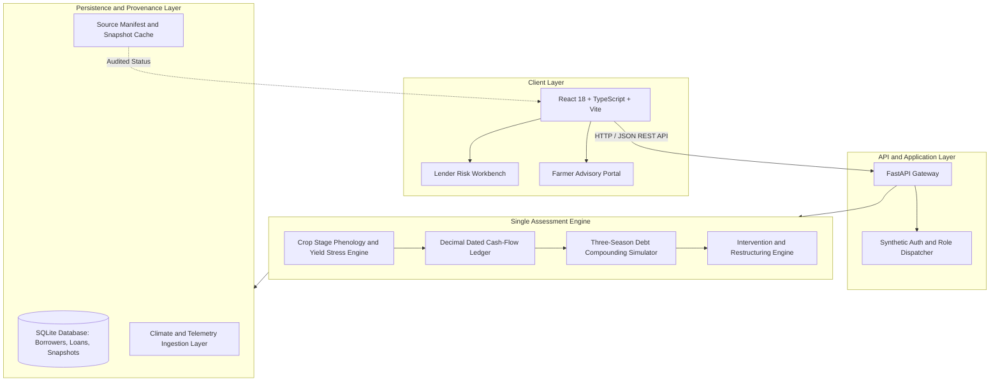

# Sage: Climate-Aware Agricultural Credit Risk Assessment

Sage is a local-first platform for climate-aware agricultural credit risk assessment and scenario analysis, implementing the FIN-03 underwriting specification. Traditional credit models rely exclusively on historical repayment records, leaving lenders blind to in-season climate shocks. Sage bridges this gap by coupling crop-stage phenological sensitivity with daily cash ledgers, contractual repayment schedules (Stress-at-Due), multi-season debt projections, and proactive lender interventions.

---

## Table of Contents

- Overview
- The Problem and Solution
- System Architecture
- Core Capabilities
- Technology Stack
- Project Structure
- Getting Started
  - Prerequisites
  - Option 1: Docker Compose (Recommended)
  - Option 2: Local Development (macOS and Linux)
  - Option 3: Local Development (Windows / PowerShell)
- Demo Walkthrough
- API Reference
- Data Provenance and Integrity
- Testing and Verification
- Configuration
- License

---

## Overview

Agricultural lending faces an inherent timing mismatch: loan repayments are tied to fixed calendar dates, while farmer cash flow depends on biological crop stages and harvest schedules. When climatic anomalies occur during sensitive phenological windows (such as heat stress during flowering or moisture deficits during grain fill), yields drop and harvest dates slip. By the time a missed payment appears on a bureau report, the debt spiral has already begun.

Sage provides institutional lenders and risk committees with forward-looking risk intelligence:
- Evaluates climate sensitivity by specific growth stage rather than aggregated seasonal rainfall.
- Simulates daily cash flow using exact Decimal-precision accounting.
- Identifies "Stress-at-Due" discrepancies where revenue arrives after contractual debt maturity.
- Projects compound debt pressure across three consecutive growing seasons (Kharif, Rabi, and Summer).
- Models restructuring interventions (such as 30-day tenure extensions and split repayments) before loans enter distress.
- Enforces strict data provenance, explicitly distinguishing between verified observations, declared assumptions, synthetic fixtures, and unavailable telemetry.

---

## The Problem and Solution

### The Lending Gap
- Traditional Underwriting: Relies on historical bureau scores and static annual income estimates. Unaware of in-season weather anomalies or stage-dependent vulnerabilities.
- Fragmented Monitoring: Weather alerts lack financial context; lenders cannot quantify the revenue or debt impact of a localized heatwave.
- Delayed Interventions: Loan restructuring is typically offered only after a default has occurred, increasing loss-given-default for the bank and debt burden for the borrower.

### The Sage Approach
- Stage-Sensitive Crop Models: Evaluates weather shocks against defined phenological stages (e.g., emergence, vegetative, flowering, grain-fill, maturity).
- Daily Dated Cash Ledger: Matches harvest realization and marketing timelines directly against contractual bank repayment dates.
- Multi-Season Compounding: Demonstrates whether an unpaid Kharif balance triggers distress borrowing and unserviceable leverage in subsequent seasons.
- Prescriptive Intervention Engine: Quantifies the cost and balance impact of proactive restructuring before default occurs.

---

## System Architecture



### Architecture Highlights
- Single Assessment Engine: All agronomic stress calculations, cash ledger bridge logic, and multi-season debt compounding execute server-side in a deterministic Python engine.
- Decimal Financial Math: Monetary figures are calculated using Python's `Decimal` type to prevent binary floating-point rounding errors.
- Cryptographic Snapshot Hashes: Evaluated scenarios generate immutable SHA-256 context fingerprints for auditability and regulatory compliance.
- Complete Offline/Loopback Isolation: Operates fully in loopback mode with local fixtures, ensuring zero external network dependency during demos and testing.

---

## Core Capabilities

### 1. Scenario Lab and Stress Simulator
Lenders can test custom or historical weather anomalies against borrower profiles. The engine evaluates:
- Extreme temperature spikes during sensitive flowering stages.
- Rainfall deficits during vegetative development and grain fill.
- Input cost fluctuations and market selling price volatility.

### 2. Stress-at-Due Cash Ledger
Generates a dated daily cash ledger that tracks:
- Planting and input expenditure outflows.
- Delayed harvest and crop marketing dates.
- Scheduled loan repayment dates (principal and interest).
- Liquidity shortfalls occurring when harvest proceeds are realized after the bank due date.

### 3. Three-Season Debt Compounding
Projects borrower solvency across three consecutive agricultural cycles:
- Cycle 1 (Current Kharif): Primary crop cycle under stress.
- Cycle 2 (Subsequent Rabi): Secondary crop cycle carrying unpaid principal, penalty interest, and emergency informal borrowing.
- Cycle 3 (Following Summer/Kharif): Terminal solvency assessment under sustained debt burden.

### 4. Borrower Intervention Engine
Simulates credit restructuring proposals against baseline and stressed scenarios:
- Reschedule 30 Days: Extends contractual due dates past delayed harvest dates.
- Split Payment: Splits single bullet repayments into staged tranches aligned with partial harvests.
- Liquidity Relief: Measures default probability reduction versus lender carrying cost.

### 5. Transparent Data Provenance
Every metric displayed in Sage carries an explicit provenance classification:
- Verified: Backed by empirical source records (e.g., historical ERA5 grid observations for Pune).
- Assumed: Disclosed parametric assumptions (e.g., baseline yield, stage sensitivity weights, price benchmarks).
- Synthetic: Generated borrower profiles, financial histories, and loan agreements.
- Unavailable: Explicitly flagged missing layers (e.g., live satellite NDVI, real-time soil moisture probes).

### 6. Role-Based Dual Interface
- Lender Workspace: Portfolio overview, borrower registry, application review, credit ledger, Scenario Lab, allocation optimizer, and data source monitor.
- Farmer Portal: Crop calendar status, weather insights, loan schedule visibility, and restructuring requests.

---

## Technology Stack

- Backend:
  - Python 3.10+
  - FastAPI 0.115+ (REST API gateway)
  - Pydantic v2 (Data contracts and validation)
  - Uvicorn (ASGI web server)
  - SQLite (Deterministic persistence and immutable snapshots)
  - Decimal arithmetic for financial accounting
- Frontend:
  - React 18.3
  - TypeScript 5.7
  - Vite 6 (Build tool and local dev server)
  - Custom Vanilla CSS Design System (Apple-inspired clean aesthetic, dark mode, responsive layouts)
  - Lucide React (Standard vector iconography)
- Operations and Containerization:
  - Docker and Docker Compose (Multi-stage builds with Nginx reverse proxy)
  - Shell and PowerShell automation scripts

---

## Project Structure

```text
Sage/
├── backend/
│   ├── app/
│   │   ├── auth/              # Synthetic authentication and role enforcement
│   │   ├── config/            # Application settings and environment configuration
│   │   ├── services/          # Core assessment engine, agronomy, and ledger logic
│   │   ├── tests/             # Regression, gate, and financial invariant test suites
│   │   ├── db.py              # SQLite schema, queries, and seeding routines
│   │   ├── main.py            # FastAPI endpoints and route handlers
│   │   └── schemas.py         # Pydantic models and request/response specifications
│   ├── Dockerfile             # Production backend container definition
│   ├── requirements.txt       # Core Python dependencies
│   ├── requirements-dev.txt   # Development and test dependencies
│   ├── verify_live.py         # Live loopback acceptance verification script
│   └── verify_offline.py      # Offline acceptance test script
├── frontend/
│   ├── src/
│   │   ├── auth/              # Auth context and login flows
│   │   ├── landing/           # Landing page sections, bento grid, and feature walkthrough
│   │   ├── App.tsx            # Main application shell, state management, and navigation
│   │   ├── HeroSection.tsx    # Editorial hero header and climate preview cards
│   │   ├── OperationsPages.tsx# Borrower dossier, loan reviews, and ledger operations
│   │   ├── types.ts           # Frontend TypeScript definitions
│   │   └── styles.css         # Design system tokens, layouts, and components
│   ├── Dockerfile             # Multi-stage frontend container build (Nginx)
│   ├── nginx.conf             # Nginx reverse proxy configuration for Docker
│   └── package.json           # Frontend dependencies and npm scripts
├── data/
│   ├── fixtures/              # Synthetic borrower profiles and walkthrough scenarios
│   ├── manifest.yaml          # Data source manifest and checksum inventory
│   └── frozen-baseline.yaml   # Canonical baseline scenario parameters
├── demo/
│   └── verification/          # Recorded test evidence, reports, and rehearsal checklists
├── docs/                      # Architectural documentation, FIN-03 scope, and Docker guides
├── scripts/                   # Local orchestration scripts (Start, Reset, Stop)
└── compose.yaml               # Docker Compose multi-service definition
```

---

## Getting Started

### Prerequisites

- Python 3.10 or higher
- Node.js 20 or higher (with npm)
- Docker Desktop or Docker Engine with Compose (Optional, for containerized run)

---

### Option 1: Docker Compose (Recommended)

Run the full platform inside containerized environments with a single command:

```bash
docker compose up --build
```

Access the application:
- Web Application: http://localhost:8080
- Backend Health Check: http://localhost:8080/health
- API Endpoints: http://localhost:8080/api/*

To stop the containers while preserving saved demo data:

```bash
docker compose down
```

To stop the containers and reset the persistent SQLite volume:

```bash
docker compose down --volumes
```

---

### Option 2: Local Development (macOS and Linux)

1. Clone the repository and navigate to the project directory:

```bash
git clone https://github.com/developmentwithparth1311/Sage.git
cd Sage
```

2. Configure environment variables:

```bash
cp .env.example .env
```

3. Set up and start the backend service:

```bash
# Create and activate virtual environment
python3 -m venv backend/.venv
source backend/.venv/bin/activate

# Install backend dependencies
pip install -r backend/requirements.txt

# Run the FastAPI server
cd backend
uvicorn app.main:app --host 127.0.0.1 --port 8000 --reload
```

4. In a separate terminal, set up and start the frontend:

```bash
cd frontend
npm ci
npm run dev
```

5. Open your browser at http://localhost:5173

---

### Option 3: Local Development (Windows / PowerShell)

From an elevated PowerShell 7 or Windows PowerShell prompt:

1. Initial installation:

```powershell
py -m venv backend/.venv
backend/.venv/Scripts/python.exe -m pip install -r backend/requirements.txt
cd frontend
npm ci
cd ..
```

2. Start both services using the automation script:

```powershell
./scripts/Start-SageDemo.ps1
```

3. To reset deterministic database records:

```powershell
./scripts/Reset-SageDemo.ps1
```

4. To stop services started by the launcher:

```powershell
./scripts/Stop-SageDemo.ps1
```

---

## Demo Walkthrough

Sage includes pre-seeded synthetic borrower profiles and canned walkthrough scenarios:

1. Sign In / Role Selection:
   - Use synthetic credentials on the login screen, or click Get Started to explore public routes.
   - Demonstration accounts include predefined Lender (Underwriter) and Farmer personas.
2. Inspect the Borrower Registry:
   - Navigate to Borrowers in the top navigation bar.
   - Review synthetic farmer dossiers, current loan terms, land holdings, and baseline agronomic assumptions.
3. Open Scenario Lab:
   - Select a borrower (e.g., Ramesh Patil, Pune maize Kharif).
   - Click "Load walkthrough" to load a verified flowering heat-wave stress event.
   - Observe how the estimated yield drops from 4,200 kg/ha to 2,604 kg/ha.
4. Review the Cash Ledger and Debt Cycle:
   - Inspect the daily cash-flow bridge: net harvest revenue shifts from surplus to deficit.
   - Inspect the Stress-at-Due alert highlighting the mismatch between delayed harvest liquidity and the scheduled bank maturity date.
   - Observe how unpaid Kharif principal carries into the Rabi season, escalating default risk.
5. Apply Restructuring Proposals:
   - Select the "Split Payment" or "Reschedule 30 Days" intervention.
   - Review the recalculation: debt sustainability index recovers, penalty fees are mitigated, and formal default is averted.
6. Export the Assessment:
   - Export structured assessment data in JSON or CSV format, or generate an audit-ready print report.

---

## API Reference

The FastAPI service exposes structured, type-checked endpoints documented via OpenAPI at `/docs` when running locally:

### Health and Seed
| Method | Endpoint | Description |
|---|---|---|
| GET | `/health` | Service status, database connectivity, and seed status |
| POST | `/api/demo/seed` | Idempotently seeds deterministic synthetic demo profiles |

### Borrowers and Applications
| Method | Endpoint | Description |
|---|---|---|
| GET | `/api/borrowers` | List all synthetic borrower profiles |
| POST | `/api/borrowers` | Create a new synthetic borrower record |
| GET | `/api/borrowers/{borrower_id}` | Retrieve comprehensive borrower dossier |
| GET | `/api/borrowers/{borrower_id}/loan` | Retrieve active loan terms and ledger for borrower |
| GET | `/api/applications` | List loan applications in review pipeline |
| POST | `/api/applications` | Submit a new loan application draft |
| PATCH | `/api/applications/{id}/status` | Transition loan review status (underwrite, approve, reject) |

### Climate and Agronomy
| Method | Endpoint | Description |
|---|---|---|
| GET | `/api/climate` | Climate telemetry by region, crop, and as-of date |
| GET | `/api/crop-calendar` | Dated phenological stage windows and calendar provenance |
| GET | `/api/telemetry/soil-moisture` | Disclosed soil moisture telemetry status |
| POST | `/api/telemetry/ndvi` | Satellite vegetation index query handler |

### Scenarios, Assessments, and Debt
| Method | Endpoint | Description |
|---|---|---|
| POST | `/api/scenarios/evaluate` | Evaluates climate stress against crop stages and cash ledger |
| POST | `/api/assessments/evaluate` | Alias for scenario evaluation returning full ScenarioBundle |
| POST | `/api/debt-cycle/evaluate` | Evaluates multi-season debt compounding |
| GET | `/api/scenarios/{scenario_id}` | Fetch immutable saved scenario assessment snapshot |
| GET | `/api/scenarios` | Catalog of saved scenario evaluation snapshots |
| GET | `/api/comparison-bundles/{id}` | Retrieve side-by-side scenario comparison bundle |

### Interventions and Allocations
| Method | Endpoint | Description |
|---|---|---|
| GET | `/api/interventions/catalog` | List available restructuring action types |
| POST | `/api/interventions/evaluate` | Evaluate financial impact of a candidate intervention |
| POST | `/api/interventions/proposals` | Create a formal intervention proposal |
| GET | `/api/interventions/proposals` | List all filed intervention proposals |
| PATCH | `/api/interventions/proposals/{id}/review` | Review, approve, or reject an intervention proposal |
| GET | `/api/watchlist` | Retrieve high-risk borrower accounts requiring intervention |
| GET | `/api/allocations/candidates` | Candidate accounts eligible for capital relief allocation |
| POST | `/api/allocations` | Execute risk budget allocation optimization |

### Sources and Provenance
| Method | Endpoint | Description |
|---|---|---|
| GET | `/api/sources` | Status of all data source adapters and admission flags |
| GET | `/api/data-sources` | Data source quality, checksum, and licensing status |
| GET | `/api/source-snapshots` | Audit trail of captured external data snapshots |
| POST | `/api/data-sources/import` | Import validated external data subset |

---

## Data Provenance and Integrity

Sage maintains strict adherence to data honesty principles:

1. Synthetic Borrower Records: All borrower names, historical financial statements, credit scores, and loan contracts are synthetically generated.
2. Parametric Climate Stress: Weather controls represent hypothetical scenario simulations. They are not issued meteorological forecasts.
3. Uncalibrated Risk Metric: The simulated default risk is an illustrative stress measure derived from cash-flow models; it is not a calibrated credit rating.
4. Cryptographic Snapshots: Every assessment snapshot is stored in SQLite with an SHA-256 hash calculated over the input configuration, ensuring that underwriting reviews cannot be modified after creation.
5. Missing Telemetry Disclosures: Parameters lacking verified real-world feeds (such as daily satellite NDVI or regional soil moisture probes) are transparently labeled as unavailable rather than filled with hidden synthetic mocks.

See [DATA_SOURCES.md](DATA_SOURCES.md) and [IMPLEMENTATION_STATUS.md](IMPLEMENTATION_STATUS.md) for full provenance documentation.

---

## Testing and Verification

The repository includes test suites covering financial invariants, gate acceptance criteria, and API smoke tests:

### Running Unit and Regression Tests
From the `backend` directory:

```bash
# Install development dependencies
pip install -r requirements-dev.txt

# Run the complete test suite
python -m unittest discover -s app/tests -v
```

### Running Specific Test Modules
```bash
# Test gate compliance
python -m unittest app.tests.test_gates -v

# Test multi-season debt engine invariants
python -m unittest app.tests.test_f7_debt -v

# Test intervention restructuring logic
python -m unittest app.tests.test_f8_interventions -v

# Test portfolio operations and ledger reconciliation
python -m unittest app.tests.test_f9_operations -v
```

### Running Offline and Live Verification Scripts
With the backend server running locally on port 8000:

```bash
cd backend
python verify_offline.py
python verify_live.py
```

### Frontend Typecheck and Production Build
From the `frontend` directory:

```bash
npm run build
```

---

## Configuration

Environment variables can be configured in a `.env` file at the repository root:

| Variable | Default | Description |
|---|---|---|
| `PRODUCT_NAME` | `Sage` | Backend service identification name |
| `VITE_PRODUCT_NAME` | `Sage` | Frontend UI product title |
| `DATABASE_URL` | `sqlite:///./sage.db` | SQLite database connection string |
| `DEMO_SEED` | `20261009` | Deterministic random seed for synthetic demo data |
| `VITE_API_BASE_URL` | `http://localhost:8000` | Target backend URL for frontend requests |
| `SAGE_HTTP_PORT` | `8080` | Host port when deploying via Docker Compose |
| `SAGE_BIND_ADDRESS` | `127.0.0.1` | Network interface binding for Docker web container |

---

## License

This project is developed for demonstration and research purposes under the FIN-03 agricultural credit evaluation framework.
